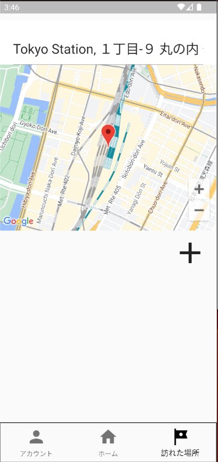

# 基本操作

## 場所を検索する

1. 画面下部の **訪れた場所** を選択します。
2. 「訪れた場所を入力してください」と表示された入力欄を選択します。
3. 場所の名前を入力します。
4. 表示された候補から、目的の場所を選択します。

候補を選択すると、その場所の名前、都道府県、位置情報が表示されます。

## 場所を登録する

検索結果の詳細を確認し、登録操作を行います。登録が完了すると、訪れた場所の一覧に表示され、対応する都道府県がホーム画面の地図に反映されます。

## 登録済みの場所を確認する

検索欄を空にすると、現在選択しているアカウントの登録済み場所が一覧表示されます。

## 場所を削除する

1. 「訪れた場所」の一覧から削除したい場所を確認します。
2. その場所の削除操作を選択します。

削除した場所は一覧から消えます。都道府県にほかの登録場所がない場合は、ホーム画面の訪問済み表示からも外れます。
