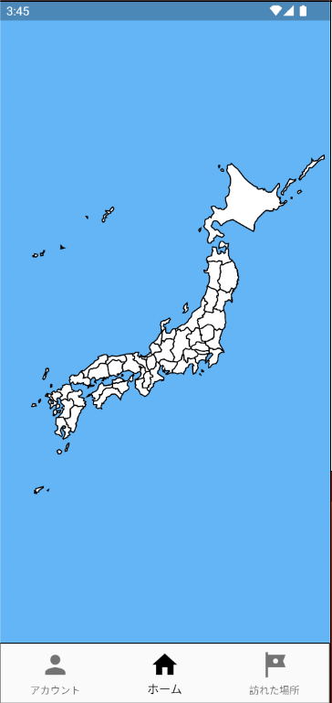
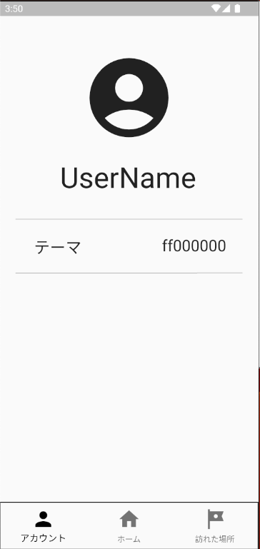

# 画面構成

## アカウント

ユーザー名、プロフィール画像、テーマカラーを設定できます。
複数のアカウントを作成した場合は、ここで表示するアカウントを切り替えます。

## ホーム

登録した場所の都道府県が、日本地図上で訪問済みとして表示されます。
登録場所が増えると、訪問した都道府県を一覧で振り返れます。

## 訪れた場所

上部の入力欄に場所の名前を入力すると候補が表示されます。候補を選択すると場所の詳細が表示され、登録できます。
検索中や通信に失敗した場合は、画面に状態やエラーメッセージが表示されます。

## アカウント画面の例

